# Chroma Sync - Complete Deep-Dive for better understanding

> This guide is built strictly from the code in our workspace because we wanted to make sure that everyone should understand what we built within 48 hours (40 hours continiuous work) 

---

# 1. Project Overview

## Project Name
**Chroma Sync** (`chroma-sync-frontend` in [frontend/package.json](frontend/package.json))

## Explanation
Chroma Sync is a shared web workspace where four different teams (Design, Engineering, Procurement, Quality) work on the **same colour-and-material decision record** for a car part, with AI helping them spot risks and conflicts before final sign-off.
Imagine a car company wants to decide *"door panel A will be matte black, made of plastic MAT-7892, from supplier X, at €12 per unit."*
Today, four teams argue over four spreadsheets and lose track.
Chroma Sync puts **one row in a database**, lets each team edit only their columns, and uses AI to say **green / yellow / red** before Quality signs it off.

## Technical explanation
A full-stack SaaS-style application:
- Multi-tenant React/TS SPA (Vite) served locally on `:5173`.
- Supabase (Postgres 15 + Auth + Realtime + Storage) as backend on `:54321`.
- Deno Edge Functions bridge Postgres → the AI service.
- Python FastAPI microservice (`:8000`) with a deterministic 6-criterion scorer plus an LLM narrator.
- Security enforced *in Postgres* via 4 defence layers (RLS + column-guard trigger + audit trigger + AI write-gate).

---

# 2. Problem Being Solved

| Question | Answer |
|---|---|
| What existed before? | Excel files, e-mails, PowerPoint decks passed between teams. Each team had its own truth. |
| Why was this built? | To have **one record, one truth** for every colour/material decision on every car component. |
| Who has the problem? | Automotive OEMs (this is a VW-group hackathon project, multi-brand). Design, Engineering, Procurement, Quality teams. |
| How does this solve it? | Single Postgres row per component; DB-level access control; AI readiness rating + conflict detection; live reports. |
| What if this system didn't exist? | Duplicate colour codes across brands, deprecated materials shipped, no audit trail, slow approvals, expensive recalls. |

---

# 3. Real-World Analogy

Think of Chroma Sync as a **hospital patient file**.

| Chroma Sync | Hospital |
|---|---|
| Decision row | The single patient chart |
| Design team | Doctor writing diagnosis |
| Engineering team | Radiologist adding scan results |
| Procurement team | Pharmacy adding the drug order |
| Quality team | Chief physician who signs the discharge |
| Approvals table | Signature page (4 signatures required) |
| Column-guard trigger | Rules like "only pharmacist can change prescription field" |
| Audit log | Nurse's handwritten log of every change |
| AI service | Junior medical assistant that flags risks but never signs |
| Project Lead | Hospital director who can override anything |

---

# 4. Technology Stack

| Technology | Where Used | Why Used | Simple Explanation | Alternative |
|---|---|---|---|---|
| **React 18 + TypeScript 5.6** | [frontend/src/](frontend/src/) | UI + type safety | The screens the user sees | Vue, Svelte, Angular |
| **Vite 5** | [frontend/vite.config.ts](frontend/vite.config.ts) | Dev server + bundler | Turns TS into fast browser code | Webpack, Turbopack |
| **React Router 6** | [App.tsx](frontend/src/App.tsx) | Client-side routing | Handles `/decisions/:id` URLs | TanStack Router |
| **Supabase (Postgres 15)** | [supabase/](supabase/) | DB + Auth + Realtime + RLS + Storage | One backend for data, login, live updates | Firebase, custom Express + Postgres |
| **pg_net** | [migrations/…_ai_hooks.sql](supabase/migrations/20260902000005_ai_hooks.sql) | Postgres → HTTP | DB can call web APIs by itself | Application-level polling |
| **pg_cron** | Same migration | Scheduled jobs inside Postgres | Runs conflict detector every 30 min | External cron job |
| **Deno + TypeScript** | [supabase/functions/](supabase/functions/) | Edge Functions | Stateless glue code between DB and AI | AWS Lambda, Node functions |
| **Python 3.11 + FastAPI 0.115** | [ai-service/app/main.py](ai-service/app/main.py) | AI microservice | Fast HTTP framework with Pydantic validation | Flask, Express |
| **Pydantic 2** | [ai-service/app/schemas.py](ai-service/app/schemas.py) | Strict LLM boundary | Rejects malformed JSON from the LLM | Manual `if` checks |
| **OpenAI / Anthropic / Mock** | [ai-service/app/llm.py](ai-service/app/llm.py) | Swappable LLM provider | Real AI or offline fake, chosen via env | Cohere, local Ollama |
| **ExcelJS + jsPDF** | [frontend/src/lib/reports.ts](frontend/src/lib/reports.ts) | Client-side report generation | Builds Excel/PDF in the browser | Server-side reporting |
| **framer-motion / recharts / mermaid / lucide-react** | [package.json](frontend/package.json) | Animations, charts, diagrams, icons | Polish for the UI | plain CSS, D3, Chart.js |
| **react-markdown** | [components/PriorityBriefingModal.tsx](frontend/src/components/PriorityBriefingModal.tsx), [MySummaryModal.tsx](frontend/src/components/MySummaryModal.tsx), [ProgrammeBriefingModal.tsx](frontend/src/components/ProgrammeBriefingModal.tsx), [ReportAISummary.tsx](frontend/src/components/ReportAISummary.tsx) | Render LLM markdown responses | Turns AI narratives into styled UI safely | dangerouslySetInnerHTML (unsafe) |
| **Deterministic audit engine** | [frontend/src/lib/auditSignals.ts](frontend/src/lib/auditSignals.ts) | Findings computed in the browser without any LLM | Fast, reproducible dashboard signals | Server-side rules engine |
| **Client-side quota** | [frontend/src/lib/aiQuota.ts](frontend/src/lib/aiQuota.ts) | Per-user, per-day AI call cap in `localStorage` | Prevents accidental cost blow-ups on public demos | Server-side counters |
| **pytest** | [ai-service/tests/](ai-service/tests/) | Testing the AI service | Automated correctness checks | unittest |
| **Podman / Docker** | Local Supabase stack | Container runtime | Runs local Postgres + Auth | Docker Desktop |

---

# 5. Complete Project Structure

```text
Chroma-Sync/
├── README.md                     ← quickstart
├── SOLUTION_DESIGN.md            ← architecture rationale
├── EXECUTION_PLAN.md             ← 10-week tracker
├── PROJECT_DEEP_DIVE.md          ← existing narrative
├── WORKFLOW_AUDIT.md
│
├── supabase/                     ← Postgres schema + Edge Functions
│   ├── config.toml
│   ├── seed.sql                  ← test users, materials
│   ├── migrations/               ← 35 SQL files, ordered by timestamp
│   │   ├── …_schema.sql          ← tables, enums, indexes
│   │   ├── …_rls.sql             ← Row Level Security
│   │   ├── …_audit_triggers.sql  ← auto audit_log inserts
│   │   ├── …_column_guards.sql   ← per-column write rules
│   │   ├── …_ai_hooks.sql        ← pg_net + pg_cron
│   │   ├── …_signup_profile.sql  ← auto profile on signup
│   │   └── …                     ← 29 later fix / feature migrations
│   └── functions/                ← Deno Edge Functions
│       ├── on-decision-submitted/  ← pg_net → /readiness
│       ├── detect-conflicts/       ← cron → /conflicts
│       ├── dima-lookup/            ← material props by code
│       └── vred-preview/           ← render URL by code
│
├── ai-service/                   ← Python FastAPI microservice
│   ├── requirements.txt
│   ├── pytest.ini
│   ├── app/
│   │   ├── main.py               ← FastAPI app, 8 endpoints
│   │   ├── schemas.py            ← Pydantic contracts (Readiness, Conflict, Summary, MySummary, ReportSummary, Chat, PriorityBriefing)
│   │   ├── prompts.py            ← LLM system prompts (readiness, narrator, conflicts, summary, briefing, chat)
│   │   ├── llm.py                ← MockClient / OpenAI / Anthropic
│   │   └── services/
│   │       ├── readiness_service.py     ← 6-criterion scorer + narrator
│   │       ├── scoring.py               ← pure-Python rules (RC-1..RC-6)
│   │       ├── conflicts_service.py     ← business-area conflict detection
│   │       ├── integrity_service.py     ← pure-Python conflict + RBAC + audit-gap detectors
│   │       ├── summary_service.py       ← per-row Meldeliste rationale
│   │       ├── my_summary_service.py    ← per-user performance markdown
│   │       ├── priority_briefing_service.py ← dual-mode: decision briefing OR programme audit narrative
│   │       ├── chat_service.py          ← multi-turn conversational assistant
│   │       └── report_summary_service.py← generic report-payload → markdown briefing
│   └── tests/test_endpoints.py
│
├── frontend/                     ← React SPA
│   ├── package.json
│   ├── vite.config.ts
│   ├── index.html
│   └── src/
│       ├── main.tsx              ← React root
│       ├── App.tsx               ← routes + auth gate
│       ├── auth/AuthContext.tsx  ← session, profile, permissions
│       ├── contexts/             ← FilterContext, toast, etc.
│       ├── lib/
│       │   ├── supabase.ts       ← typed client + AI_SERVICE_URL
│       │   ├── ai.ts             ← runReadinessCheck() + all direct AI HTTP calls
│       │   ├── aiQuota.ts        ← localStorage per-user AI daily cap (2/day, 4 for admin)
│       │   ├── auditSignals.ts   ← deterministic dashboard findings (no LLM)
│       │   └── reports.ts        ← Meldeliste xlsx + Colour-Mix pdf
│       ├── types/db.ts           ← hand-written DB types
│       ├── utils/permissions.ts  ← ROLE_PERMISSIONS map (12 roles × 20+ permissions)
│       ├── pages/
│       │   ├── Landing.tsx  Login.tsx  Signup.tsx
│       │   ├── Dashboard.tsx  DashboardHome.tsx (executive overview + RC heatmap)
│       │   ├── NewDecision.tsx  DecisionDetail.tsx
│       │   ├── MasterDataAdmin.tsx      ← catalogue: components, materials, suppliers, VRED, hierarchies
│       │   ├── decisions/               ← OpenPool, MyQueue, MyApprovals, MyHistory, MySubmissions, PendingReview, Conflicts
│       │   ├── reports/                 ← Meldeliste, ColourMixChart, AIReadinessReport, SupplyChainReport, ComplianceAuditReport
│       │   └── settings/                ← Profile, Rbac (roles + permission matrix + members + invites), AuditLogs
│       └── components/
│           ├── layout/           ← AppShell, Header, Sidebar (role-aware nav + live badges)
│           ├── ApprovalPanel.tsx  ApprovalHistory.tsx  DecisionHistory.tsx  DecisionFields.tsx
│           ├── RatingBadge.tsx  ConflictBanner.tsx  MaterialContext.tsx  ColourPicker.tsx
│           ├── AiAnalysingOverlay.tsx  AiDecisionIntelModal.tsx  AiGuideModal.tsx
│           ├── ChatAssistant.tsx  MySummaryModal.tsx  PriorityBriefingModal.tsx  ProgrammeBriefingModal.tsx
│           ├── ReportAISummary.tsx  RCReferenceModal.tsx  WorkflowGuideModal.tsx  SearchPalette.tsx
│           └── LogoMark.tsx  Reveal.tsx  Mermaid.tsx  FluidBackdrop.tsx  useCountUp.tsx  useLandingFx.ts
│
└── scripts/ipv4-proxy.cjs        ← dev-only network helper
```

---

# 6. Folder-by-Folder Explanation as though a 5-10 min video is NOT enough

### `supabase/migrations/`
- **Purpose:** every schema change, in order.
- **Why it exists:** the database is the source of truth for structure *and* security.
- **What's inside:** timestamped `.sql` files, applied automatically on `supabase db reset`.
- **Who calls it:** the Supabase CLI at start-up; nobody at runtime.
- **What leaves it:** the resulting schema (tables, RLS, triggers, cron jobs).
- **If removed:** you have no database, no security, no audit - the entire app is gone.
- **Analogy:** the hospital's rulebook printed once in stone; every new rule is a new page (never a tear-out).

### `supabase/functions/`
- **Purpose:** stateless glue between Postgres and the AI service.
- **Files:** `on-decision-submitted`, `detect-conflicts`, `dima-lookup`, `vred-preview`.
- **Who calls it:** Postgres via `pg_net` (see [migrations/…_ai_hooks.sql](supabase/migrations/20260902000005_ai_hooks.sql)); browser for `dima-lookup` / `vred-preview`.
- **What leaves it:** a POST body to `http://<AI_URL>/readiness` or `/conflicts`, then an `update decisions` back into Postgres.
- **If removed:** the DB can no longer talk to the AI. Ratings stay `null` forever.
- **Analogy:** the intercom between the ward (DB) and the assistant's office (AI).

### `ai-service/app/`
- **Purpose:** all AI logic. Deterministic scorer + LLM narrator.
- **Split:** `main.py` (routes) → `services/` (business logic) → `llm.py` (provider) → `schemas.py` (contracts).
- **Who calls it:** the two Edge Functions; the frontend directly (via [lib/ai.ts](frontend/src/lib/ai.ts)) for chat / summary / briefing.
- **What leaves it:** JSON responses with `rating`, `reason`, `flags`.
- **If removed:** decisions never get an AI rating, conflicts are never auto-detected. UI still works (writes fall through in [on-decision-submitted/index.ts](supabase/functions/on-decision-submitted/index.ts) with `ai_rating: "yellow"`).
- **Analogy:** the AI assistant's brain and mouth.

### `frontend/src/pages/`
- **Purpose:** the screens themselves.
- **Files:** `Landing.tsx`, `Login.tsx`, `Signup.tsx`, `Dashboard.tsx`, `DashboardHome.tsx`, `NewDecision.tsx`, `DecisionDetail.tsx`, `MasterDataAdmin.tsx`, and sub-folders `decisions/`, `reports/`, `settings/`.
- **Who calls it:** React Router (see [App.tsx](frontend/src/App.tsx)) based on URL.
- **What leaves it:** Supabase `from().select()` reads, `insert/update` writes, `channel().on('postgres_changes')` subscriptions, and direct `/priority-briefing`, `/my-summary`, `/report-summary`, `/chat` HTTP calls.
- **If removed:** users see nothing.
- **Analogy:** the menus and tables in the restaurant.

### `frontend/src/pages/decisions/`
- **Purpose:** every work-queue-style list of decisions for the logged-in user.
- **Files:** `OpenPool` (unclaimed team tasks), `MyQueue` (claimed and awaiting my action), `MyApprovals` (things I approved), `MyHistory` (everything I ever touched), `MySubmissions` (rows I created), `PendingReview` (in-flight cross-team), `Conflicts` (RC-6 duplicates & mismatches).
- **Communicates with:** Supabase reads filtered by `current_user_id` / team, plus realtime `decisions-live` and `conflicts-live` channels.

### `frontend/src/pages/reports/`
- **Purpose:** exportable programme reports.
- **Files:** `Meldeliste.tsx`, `ColourMixChart.tsx`, `AIReadinessReport.tsx`, `SupplyChainReport.tsx`, `ComplianceAuditReport.tsx`.
- **AI overlay:** each report (except `ComplianceAuditReport`, which is intentionally deterministic) drops a `ReportAISummary` component that POSTs the report payload to `/report-summary` and renders the markdown briefing on demand (quota-gated).

### `frontend/src/pages/settings/`
- **Purpose:** admin surface.
- **Files:** `Profile.tsx` (self), `Rbac.tsx` (roles + permission matrix + members + invites), `AuditLogs.tsx` (queryable `audit_log` with JSON diff view).

### `frontend/src/components/layout/`
- **Purpose:** app chrome.
- **Files:** `AppShell.tsx` (header + sidebar + `<Outlet />` + toasts + floating `ChatAssistant`), `Sidebar.tsx` (role-aware nav sections with live count badges), `Header.tsx`.

### `frontend/src/components/`
- **Purpose:** reusable UI pieces.
- **Key ones:** `ApprovalPanel` (gate logic), `RatingBadge` (green/yellow/red), `DecisionFields` (per-team form), `ConflictBanner`, `Chat/AI modals` (`ChatAssistant`, `MySummaryModal`, `PriorityBriefingModal`, `ProgrammeBriefingModal`, `AiDecisionIntelModal`, `AiGuideModal`, `AiAnalysingOverlay`, `RCReferenceModal`, `WorkflowGuideModal`), `SearchPalette` (Cmd+K), `ReportAISummary` (LLM overlay on report pages).
- **Analogy:** the plates, cutlery, and napkins used across every table.

### `frontend/src/auth/`, `contexts/`, `lib/`, `utils/`, `types/`
- **Auth:** session + profile + role permissions.
- **Contexts:** global filter (date range), toasts.
- **Lib:** the Supabase client (`supabase.ts`), AI HTTP helpers (`ai.ts`), report generators (`reports.ts`), **client-side quota** (`aiQuota.ts`), **deterministic audit engine** (`auditSignals.ts`).
- **Utils:** `permissions.ts` maps `RoleKey` → allowed `PermissionKey`s (12 roles × 20+ permissions).
- **Types:** hand-written `Database` type (drift risk - see weak links).

---

# 7. File-by-File Important Explanation


### [supabase/migrations/20260902000001_schema.sql](supabase/migrations/20260902000001_schema.sql)
- Creates enums (`team_t`, `decision_status_t`, `approval_status_t`, `ai_rating_t`) and tables (`profiles`, `materials`, `decisions`, `approvals`, `audit_log`, `conflicts`).
- Two helper functions: `current_team()` and `is_project_lead()` - used by every RLS policy.


### [supabase/migrations/20260902000002_rls.sql](supabase/migrations/20260902000002_rls.sql)
- **All authenticated users can read everything** - that's the "transparency" pillar.
- Writes are gated by team ownership at row level.

### [supabase/migrations/20260902000004_column_guards.sql](supabase/migrations/20260902000004_column_guards.sql)
- `BEFORE UPDATE` trigger `decisions_column_guard()`.
- Rejects a write if a team touched a column it doesn't own.
- Rejects AI-column writes when `auth.uid()` is not null (only `service_role` may write them).
- Enforces the status state machine (`draft → submitted → under_review → approved/rejected`).

### [supabase/migrations/20260902000003_audit_triggers.sql](supabase/migrations/20260902000003_audit_triggers.sql)
- `AFTER` triggers on `decisions` and `approvals` insert into `audit_log`.
- Uses `SECURITY DEFINER` so it can bypass RLS on `audit_log` (which has select-only policies).
- Captures `old_values` / `new_values` as JSONB.

### [supabase/migrations/20260902000005_ai_hooks.sql](supabase/migrations/20260902000005_ai_hooks.sql)
- Uses **pg_net** to fire `net.http_post(...)` when a decision transitions to `submitted`.
- Uses **pg_cron** to schedule `/detect-conflicts` every 30 minutes.
- Requires two GUCs set at DB level: `app.supabase_functions_url` and `app.service_role_key`.

### [supabase/migrations/20260902000006_signup_profile.sql](supabase/migrations/20260902000006_signup_profile.sql)
- `after insert on auth.users` trigger auto-inserts a `profiles` row from `raw_user_meta_data`.

### [supabase/functions/on-decision-submitted/index.ts](supabase/functions/on-decision-submitted/index.ts)
- **Input:** `{ decision_id }`.
- **Process:** service-role Supabase client → fetch decision, material, approvals → POST to `<AI_URL>/readiness` → write result back onto the decision row.
- **Fallback:** on non-2xx from AI, writes `ai_rating: "yellow"` + `ai_unavailable` flag.

### [supabase/functions/detect-conflicts/index.ts](supabase/functions/detect-conflicts/index.ts)
- **Input:** none (cron).
- **Process:** load all `submitted / under_review / approved` decisions → group by `business_area` → POST to `/conflicts` → insert unique unresolved rows into `conflicts`.
- **Idempotency:** `.or(...)` check with both `(a,b)` and `(b,a)` before insert.

### [ai-service/app/main.py](ai-service/app/main.py)
- 5 POST endpoints: `/readiness`, `/conflicts`, `/summarise`, `/my-summary`, `/priority-briefing`; 1 GET `/health`.
- CORS wide open (`allow_origins=["*"]`) - a documented weakness.

### [ai-service/app/schemas.py](ai-service/app/schemas.py)
- Pydantic models are the **contract**. `RawLlmReadiness`, `RawLlmConflicts`, `SummaryItem` reject invalid LLM output.
- Every enum is `Literal[...]` so the type system catches typos.

### [ai-service/app/prompts.py](ai-service/app/prompts.py)
- Three big system prompts (`READINESS_SYSTEM`, `READINESS_NARRATOR_SYSTEM`, plus conflict / summary prompts).
- Each explicitly says *"Respond ONLY with a single JSON object matching this schema"*.
- Prompts enumerate RC-1..RC-6 rules but explicitly forbid the model from using the codes in output.

### [ai-service/app/llm.py](ai-service/app/llm.py)
- `Protocol LlmClient` with `complete_json` / `complete_text`.
- `MockClient` inspects the request and returns *deterministic context-aware* JSON - used in tests and offline demos.
- `build_client()` picks between mock / OpenAI / Anthropic by env `LLM_PROVIDER`.

### [ai-service/app/services/scoring.py](ai-service/app/services/scoring.py)
- Pure functions `score_rc1..score_rc6` + `worst_colour`.
- Ratings are reproducible from a spreadsheet; the LLM cannot change them.

### [ai-service/app/services/readiness_service.py](ai-service/app/services/readiness_service.py)
- Runs the 6 scorers → gets `deterministic_aggregate` → calls the LLM with that as context → LLM may **only** narrate; final rating is `max(llm_rating, deterministic)` on the `green<yellow<red` scale.
- On timeout / bad JSON: uses `_summarise()` (deterministic sentence).

### [frontend/src/lib/supabase.ts](frontend/src/lib/supabase.ts)
- Creates one typed Supabase client from `VITE_SUPABASE_URL` / `VITE_SUPABASE_ANON_KEY`.
- Throws early if the envs are missing.
- Exports `AI_SERVICE_URL`.

### [frontend/src/auth/AuthContext.tsx](frontend/src/auth/AuthContext.tsx)
- Wraps `supabase.auth`. Publishes `session`, `profile`, `role`, `hasPermission(...)`.
- Includes a **dev-bypass** login (mock session) for local demos - worth calling out as a demo-only convenience.

### [frontend/src/lib/ai.ts](frontend/src/lib/ai.ts)
- `runReadinessCheck(decisionId)` - assembles decision + material + VRED rows + siblings + approver profiles, POSTs to `/readiness`, and then writes back via an RPC.
- Contains the client-side fallback path used when the browser triggers a re-score (in addition to the DB-driven one).

### [frontend/src/App.tsx](frontend/src/App.tsx)
- If no session → Landing / Login / Signup.
- If session → `AppShell` layout + nested routes for decisions, reports, settings.

### [frontend/src/pages/Dashboard.tsx](frontend/src/pages/Dashboard.tsx)
- Loads decisions, subscribes to realtime `postgres_changes`, filters by area/status/AI, offers Meldeliste + Colour-Mix export.

### [frontend/src/pages/NewDecision.tsx](frontend/src/pages/NewDecision.tsx)
- **Design-only** form (component, colour, material, finish, temperature range, UV, chemicals, file uploads).
- Calls `runReadinessCheck` after insert.

### [frontend/src/components/ApprovalPanel.tsx](frontend/src/components/ApprovalPanel.tsx)
- Encodes the gate: `getGateStatus(team, approvals, designStatus)`.
- Rules: Design must approve first → Engineering → Procurement → Quality (Quality last). Any rejection cascades.

### [frontend/src/lib/reports.ts](frontend/src/lib/reports.ts)
- **Meldeliste** Excel via ExcelJS: approved rows, calls `/summarise` per record to produce natural-language rationale columns.
- **Colour-Mix-Chart** PDF via jsPDF+autotable: matrix components × colour codes, shaded by approval status.

### [frontend/src/lib/aiQuota.ts](frontend/src/lib/aiQuota.ts)
- Client-side, `localStorage`-backed AI budget per user per day. Key pattern `ai_quota_<feature>_<YYYY-MM-DD>_<userId>`.
- `getUsesRemaining`, `consumeUse`, `restoreUse`, `getMaxDailyUses`. Daily cap: **2** for everyone, **4** for `project_admin`.
- Features currently gated: `my_summary`, `priority_briefing`, `chat`, `report_summary`.


### [frontend/src/lib/auditSignals.ts](frontend/src/lib/auditSignals.ts)
- Pure TypeScript rules engine. Never calls an LLM.
- Exports `runAudit(decisions, approvals, conflicts) → { summary, findings[], crossTeamImpact[] }`.
- Detectors: `detectBlockedDecisions`, `detectApprovalBottlenecks`, `detectStaleApprovals`, `detectRbacViolations`, `detectAuditGaps`, plus RC-1..RC-6 evidence.
- Used by `DashboardHome` for the executive overview and by `ComplianceAuditReport` for the audit findings table. Its `AuditFinding[]` is also passed *as context* into `/priority-briefing` so the LLM can narrate deterministic evidence - never invent it.

### [frontend/src/pages/DashboardHome.tsx](frontend/src/pages/DashboardHome.tsx)
- Executive overview. Loads decisions with the six per-criterion columns, computes `runAudit(...)`, renders the RC-1..RC-6 heatmap, status pie, AI-rating breakdown, and findings cards.
- Button *"Generate Programme Briefing"* opens `ProgrammeBriefingModal` which POSTs to `/priority-briefing` with `context="audit_narrative"` and the deterministic findings.

### [frontend/src/pages/MasterDataAdmin.tsx](frontend/src/pages/MasterDataAdmin.tsx)
- Admin catalogue for `components`, `materials`, `master_suppliers`, `master_business_areas` (hierarchical), `master_feasibility_statuses`, `master_technical_constraints`, `master_design_statuses`, `master_uv_requirements`, `master_chemical_resistances`, `vred_visualizations`.
- Gated by `settings.manage` permission (project lead only).

### [frontend/src/pages/decisions/*](frontend/src/pages/decisions/)
- `OpenPool` - shared team queue (rows where `<team>_owner_id IS NULL` and Design gate is open).
- `MyQueue` - rows I claimed (`<team>_owner_id = auth.uid()`), pending my approval.
- `MyApprovals` - approvals I already submitted.
- `MyHistory` - every decision I ever authored, edited or approved.
- `MySubmissions` - rows where `created_by = auth.uid()` (Design view).
- `PendingReview` - cross-team in-flight (status `submitted` / `under_review`).
- `Conflicts` - RC-6 board: colour, material, finish, lifecycle, and visual-mismatch conflicts, tabs *Open / Resolved*, click to jump to either decision, mark resolved sets `conflicts.resolved = true`.

### [frontend/src/pages/reports/*](frontend/src/pages/reports/)
- `Meldeliste.tsx` - approved-decisions Excel (per-row `/summarise`).
- `ColourMixChart.tsx` - components × colour codes PDF.
- `AIReadinessReport.tsx` - RC-1..RC-6 aggregates and heatmap.
- `SupplyChainReport.tsx` - supplier concentration, lead-time histogram, compliance failures.
- `ComplianceAuditReport.tsx` - deterministic-only (no AI overlay by policy): audit findings + JSON diff evidence, intended for regulator export.

### [frontend/src/pages/settings/*](frontend/src/pages/settings/)
- `Profile.tsx` - user profile (mostly read-only, Supabase Auth owns password).
- `Rbac.tsx` - four tabs: Role Definitions, Permission Matrix (12 × 20+), Team Members, Invitations.
- `AuditLogs.tsx` - queryable view over `audit_log` with `old_values` / `new_values` JSON diff and `is_admin_override` flag.

### [frontend/src/components/layout/Sidebar.tsx](frontend/src/components/layout/Sidebar.tsx)
- Role-aware navigation. Sections: Overview, Decisions, My Work, Reports, Settings.
- Live badges (Open Pool, My Queue, Conflicts) driven by Supabase count queries + realtime.
- Collapsible; theme toggle; hides `Master Data`, `Team & Roles`, `Activity Log` from users without the corresponding permission.

### [frontend/src/components/ChatAssistant.tsx](frontend/src/components/ChatAssistant.tsx)
- Floating bubble mounted by `AppShell`. Multi-turn chat, POSTs to `/chat` with `messages`, `user_team`, `is_project_lead`, context. Quota-gated (`chat` feature key).

### [frontend/src/components/MySummaryModal.tsx](frontend/src/components/MySummaryModal.tsx)
- Sends the user's own decisions to `/my-summary`, renders markdown (Performance Snapshot / Brilliant Work / Deep Dive / Recommendations). Quota-gated.

### [frontend/src/components/PriorityBriefingModal.tsx](frontend/src/components/PriorityBriefingModal.tsx)
- Per-decision briefing. Computes local deterministic signals then POSTs to `/priority-briefing` with `context="decision_briefing"`. Renders structured `{headline, overview, items[]}`. Quota-gated.

### [frontend/src/components/ProgrammeBriefingModal.tsx](frontend/src/components/ProgrammeBriefingModal.tsx)
- Portfolio-wide narrative. Runs `runAudit(...)` client-side, POSTs full findings to `/priority-briefing` with `context="audit_narrative"`. Renders `{executive_summary, finding_narratives}` as markdown.

### [frontend/src/components/AiDecisionIntelModal.tsx](frontend/src/components/AiDecisionIntelModal.tsx)
- Static explainer: how AI evaluates a decision, when it engages, what data sources it uses. 

### [frontend/src/components/ReportAISummary.tsx](frontend/src/components/ReportAISummary.tsx)
- Wrapper mounted on report pages. Takes any JSON payload, POSTs to `/report-summary`, renders markdown. Consumes daily quota when opened.

### [frontend/src/components/RCReferenceModal.tsx](frontend/src/components/RCReferenceModal.tsx) / [WorkflowGuideModal.tsx](frontend/src/components/WorkflowGuideModal.tsx) / [AiGuideModal.tsx](frontend/src/components/AiGuideModal.tsx)
- Reference / help modals opened from Help menu. Static content; no LLM calls.

### [frontend/src/components/SearchPalette.tsx](frontend/src/components/SearchPalette.tsx)
- Cmd/Ctrl+K global search across decisions by component, colour code, material code, business area.

### [frontend/src/components/ApprovalHistory.tsx](frontend/src/components/ApprovalHistory.tsx) / [DecisionHistory.tsx](frontend/src/components/DecisionHistory.tsx)
- `ApprovalHistory` - timeline of the 4 team approvals with notes and timestamps.
- `DecisionHistory` - decoded `audit_log` for a decision with `old_values → new_values` JSON diff.

### [ai-service/app/services/chat_service.py](ai-service/app/services/chat_service.py)
- Handles `/chat`. Uses `CHAT_SYSTEM` prompt, 30 s timeout, 2 attempts with JSON cleaning, deterministic fallback.

### [ai-service/app/services/my_summary_service.py](ai-service/app/services/my_summary_service.py)
- Handles `/my-summary`. Elite-tone Performance Snapshot in markdown; graceful fallback when the user has no submitted decisions.

### [ai-service/app/services/priority_briefing_service.py](ai-service/app/services/priority_briefing_service.py)
- Handles `/priority-briefing` in **two modes**:
  1. `context="decision_briefing"` - one decision + approvals + conflicts + frontend signals → `{headline, overview, items[]}`.
  2. `context="audit_narrative"` - the whole portfolio + `AuditFinding[]` → `{executive_summary, finding_narratives{category: text}}`.

### [ai-service/app/services/report_summary_service.py](ai-service/app/services/report_summary_service.py)
- Handles `/report-summary`. Accepts an arbitrary report JSON payload; returns a markdown briefing.

### [ai-service/app/services/integrity_service.py](ai-service/app/services/integrity_service.py)
- Pure Python (no LLM). `detect_all(decisions)` runs `find_pair_conflicts`, `find_lifecycle_conflicts`, `find_orphan_materials`, `find_rbac_violations`, `find_visual_mismatches`, `find_audit_gaps` and returns `ConflictItem[]`. Called from `conflicts_service` as the deterministic backbone before the LLM narrates.

---

# 8. Architecture

Chroma Sync is a **3-tier layered architecture** with a **security-first Postgres core**:

1. **Presentation** - React SPA (Vite dev server, static in prod).
2. **Data + Security + Realtime** - Supabase Postgres. This tier owns *rules* not just data.
3. **Intelligence** - FastAPI microservice reached via Deno Edge Functions.

Cross-cutting: strict schemas at every LLM boundary; audit log written by triggers; AI columns writable only by service-role.

---

# 9. Mermaid Architecture Diagram

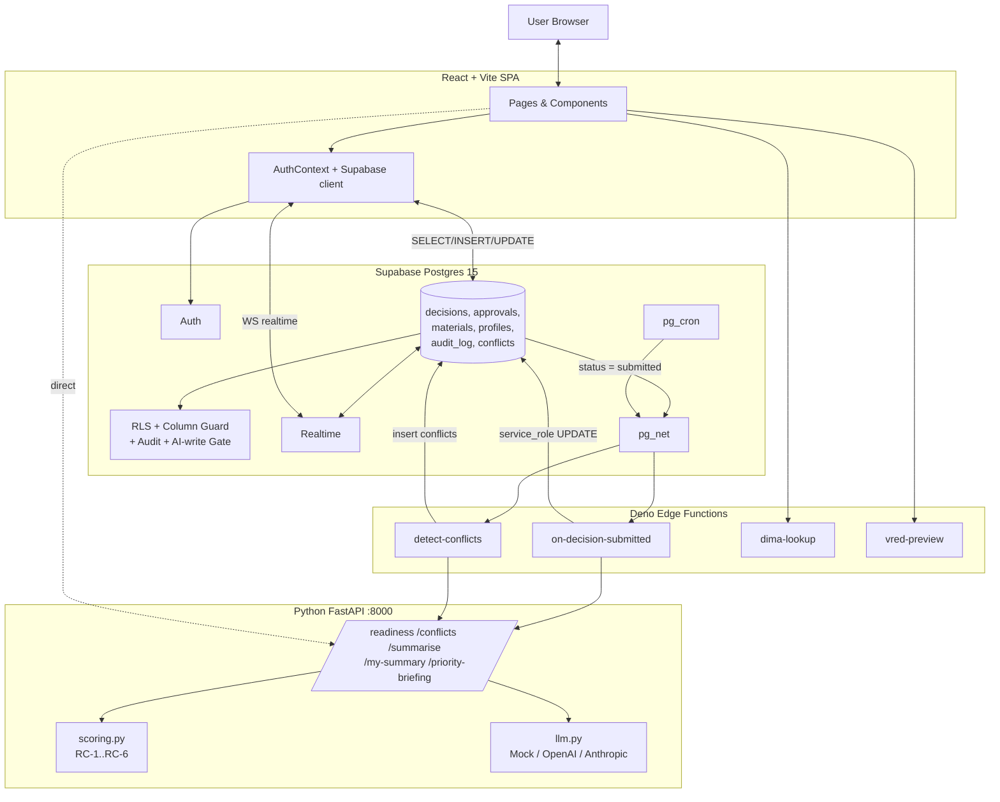

---

# 10. Folder Communication (arrow-by-arrow)

### `frontend/src/pages/*` → `frontend/src/lib/supabase.ts`
- Every page imports `supabase` and calls `.from('table').select/insert/update()` or subscribes to `.channel(...)`.
- **Auth header:** attached automatically by `@supabase/supabase-js` from the persisted session (localStorage).

### `frontend/` → `supabase.decisions` (INSERT)
- **Method:** HTTPS POST to `/rest/v1/decisions`.
- **Headers:** `apikey`, `authorization: Bearer <access_token>`.
- **Body:** JSON with the decision fields.
- **What happens next:** RLS `decisions_insert_design` checks `current_team() = 'design'`. If not, 42501.

### `frontend/` → `supabase.decisions` (UPDATE status='submitted')
- Body includes `status: 'submitted'`.
- Triggers fire **in this order:** column-guard (BEFORE) → row update → audit (AFTER row) → notify (AFTER of status column).
- `notify_decision_submitted()` calls `net.http_post(<functions_url>/on-decision-submitted, ...)`.

### Postgres → Edge Function
- **Transport:** async HTTP via `pg_net` (fire-and-forget, no return value).
- **Body:** `{"decision_id": "<uuid>"}`.
- **Auth:** `Bearer <service_role_key>` from `app.service_role_key`.

### Edge Function → FastAPI
- POST `/readiness` with `{decision, material, approvals}`.
- **Auth:** none right now (documented weakness - see §27).

### FastAPI → LLM
- Provider chosen by `LLM_PROVIDER` env.
- `readiness_service.evaluate()` waits max `_LLM_TIMEOUT = 20s`.
- Any failure → deterministic-only response.

### FastAPI → Edge Function (response)
- JSON: `{rating, reason, flags}`.

### Edge Function → Postgres (UPDATE decisions)
- Uses service-role → bypasses column-guard's non-AI checks (guard exempts `v_is_service`).

### Postgres → Frontend (Realtime)
- WebSocket channel `decisions-live` fires on every row change.
- The UI just re-runs `load()` - simple and effective.

### Frontend → FastAPI (direct)
- `runReadinessCheck` and modal features (Chat, PriorityBriefing, MySummary) call the AI service directly from the browser using `AI_SERVICE_URL`.

---

# 11. Complete Request Flow - "Design submits a new decision"

```text
Step 1  User clicks "Submit" on NewDecision.tsx form
Step 2  React calls supabase.from('decisions').insert({..., status: 'draft'})
Step 3  Later, on Detail page, user changes status to 'submitted'
Step 4  supabase-js sends PATCH /rest/v1/decisions?id=eq.<id>
Step 5  Postgres: BEFORE UPDATE fires decisions_column_guard()
        - v_team = 'design', not service, not lead
        - No AI columns changed → OK
        - status: draft→submitted, team=design → allowed
Step 6  Row updates. AFTER UPDATE audit_row_change() inserts into audit_log.
Step 7  AFTER UPDATE OF status notify_decision_submitted() fires pg_net.
Step 8  Deno Edge Function 'on-decision-submitted' receives {decision_id}
Step 9  It uses service_role to SELECT decision + material + approvals
Step 10 POST http://ai:8000/readiness with the payload
Step 11 FastAPI Pydantic validates ReadinessRequest → readiness_service.evaluate
Step 12 scoring.score_all() computes 6 CriterionResults deterministically
Step 13 worst_colour(...) → deterministic_aggregate (e.g. 'yellow')
Step 14 _deep_analysis() calls LLM with the deterministic evaluation
Step 15 LLM returns {rating, reason, flags}; final rating = max(det, llm)
Step 16 FastAPI returns JSON
Step 17 Edge Function UPDATE decisions SET ai_rating=..., ai_reason=...
        (allowed: v_is_service = true, bypasses column-guard)
Step 18 Postgres publishes the change on the realtime channel
Step 19 All Dashboard tabs listening on 'decisions-live' re-run load()
Step 20 The badge next to the row flips green/yellow/red
```

---

# 12. Mermaid Request Flow

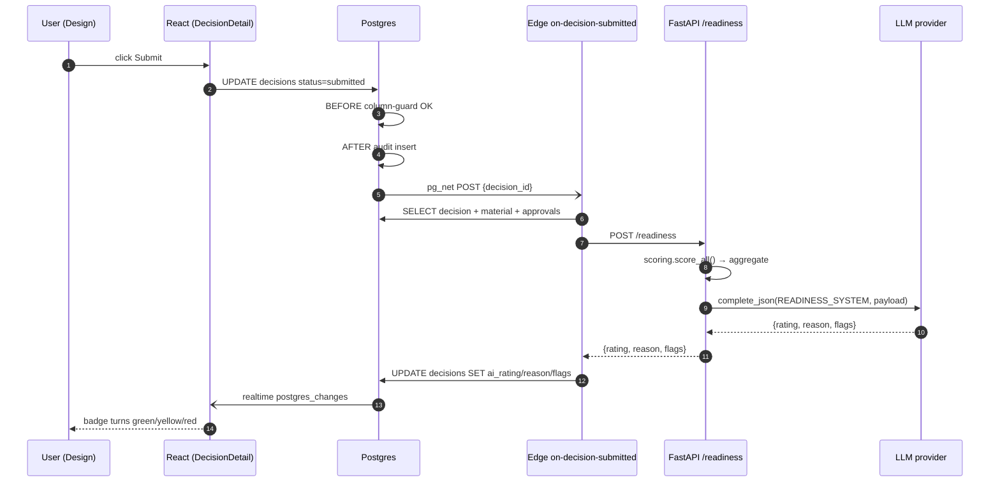

---

# 13. Data Flow

```text
INPUT (form fields)
   ↓
Zod / React state validation (client-side only)
   ↓
Supabase REST (JWT attached)
   ↓
RLS policy (row visibility)
   ↓
BEFORE UPDATE column-guard (per-column ownership + state machine)
   ↓
decisions row mutated
   ↓
AFTER trigger → audit_log INSERT (old + new values as jsonb)
   ↓
AFTER trigger → pg_net → Edge Function
   ↓
Edge Function → FastAPI /readiness
   ↓
Pydantic strict parse (ReadinessRequest)
   ↓
scoring.py (deterministic ratings + evidence dict)
   ↓
LLM narrator (reason sentence, may raise rating)
   ↓
ReadinessResponse (Pydantic-validated on the way out)
   ↓
Edge Function service_role UPDATE decisions (AI-only columns)
   ↓
Postgres Realtime WebSocket
   ↓
React setState → RatingBadge re-renders
   ↓
USER sees green/yellow/red + reason tooltip
```

Data pieces:
- **Request body** - decision fields.
- **Query params** - `id=eq.<uuid>` on PostgREST.
- **Headers** - `apikey`, `Authorization: Bearer …`.
- **Errors** - Postgres error code `42501` (insufficient privilege) is the most common signal that RLS/guard blocked a write.

---

# 14. Database

## Technology
Postgres 15 (via Supabase local stack on port 54322). Extensions: `pgcrypto`, `pg_net`, `pg_cron`.

## Core tables (from [migrations/…_schema.sql](supabase/migrations/20260902000001_schema.sql) + later)

| Table | Purpose | Key fields |
|---|---|---|
| `profiles` | one row per auth.users id | `id` FK to auth.users, `team`, `is_project_lead`, `full_name`, `is_editor`, `is_approver` |
| `materials` | DiMa catalogue | `code` PK, `display_name`, `gloss`, `temperature_min_c/max_c`, `lifecycle_status`, `compliance_status`, `lead_time_weeks`, `finish`, `ral_code`, `hex_colour` |
| `decisions` | THE core table | `id`, `component_name`, `business_area`, `model_year`, per-team owned fields, `status`, `owner_team`, `version`, `created_by`, `<team>_owner_id` (claim tracking), AI: `ai_rating`, `ai_reason`, `ai_flags`, `ai_last_checked_at`, `rc1_lifecycle`, `rc2_compliance`, `rc3_lead_time`, `rc4_visual`, `rc5_approval_rbac`, `rc6_conflict`, `rc_flags` (jsonb) |
| `approvals` | 1 per (decision, team, version) - 4 rows per version | `decision_id`, `team`, `status`, `approved_by`, `notes`, `version` |
| `audit_log` | trigger-written | `table_name`, `row_id`, `action`, `changed_by`, `old_values`, `new_values`, `is_admin_override` |
| `conflicts` | AI-detected + rule-based duplicates / cross-area clashes | `decision_a_id`, `decision_b_id`, `conflict_type`, `explanation`, `resolved` |
| `components` | master list of car components | `id`, `name`, `zone`, `vehicle_program` |
| `master_finishes` / `_design_statuses` / `_uv_requirements` / `_chemical_resistances` / `_feasibility_statuses` / `_technical_constraints` | catalogue lookup tables | `code`, `label` |
| `master_suppliers` | supplier master | `code`, `name`, `lead_time_weeks`, `reliability_score` |
| `master_business_areas` | hierarchical areas (Exterior → Panels → Door) | `id`, `name`, `parent_id` |
| `vred_visualizations` | VRED 3D render metadata | `id`, `component_id`, `material_code`, `status` (`rendered`/`mismatch`), `render_url` |
| `document_uploads` | Design reference docs (PDF/images) | `id`, `decision_id`, `file_name`, `file_url`, `uploaded_by`, `uploaded_at` |
| `ai_summary_quotas` | per-decision per-team hard cap (2 views) | `decision_id`, `team`, `views_used` |
| `decision_snapshots` | version-frozen JSON snapshot on version bump | `id`, `decision_id`, `version`, `snapshot_jsonb` |

## Indexes
`decisions_business_area_idx`, `decisions_status_idx`, `decisions_owner_team_idx`, `decisions_material_ref_idx`, `decisions_model_year_idx`, `approvals_decision_idx`, `approvals_version_idx`, `conflicts_pair_idx`.

## CRUD

| Op | Who | Where |
|---|---|---|
| INSERT decisions | Only `design_editor` / `design_approver` (RLS + role check) | `NewDecision.tsx` |
| UPDATE decisions (data) | Owning team, per-column (guard) | column-guard trigger |
| UPDATE decisions (AI cols) | Service-role only (AI write-gate) | Edge Function |
| UPDATE decisions (override) | Project lead via `override_decision_field(...)` RPC; logged with `is_admin_override=true` | `MasterDataAdmin.tsx`, admin flows |
| DELETE decisions | Nobody (no policy) | - |
| INSERT/UPDATE approvals | Own team's editor/approver only | `ApprovalPanel.tsx` |
| INSERT audit_log | Trigger only (SECURITY DEFINER) | migration 0003 |
| INSERT conflicts | Service-role via Edge; also RLS insert policy from mig 0914 for user-flag flows | `detect-conflicts`, Conflicts page |
| Increment quota | `increment_ai_quota(decision_id, team)` RPC | `MySummaryModal`, `PriorityBriefingModal` |
| INSERT ai_readiness | `set_ai_readiness(decision_id, rating, reason, flags[, rc1..rc6, rc_flags])` RPC | AI service via Edge |

## Fully-approved rule
A decision is "approved overall" only when all 4 `approvals` rows are `status='approved'` **for the current `decisions.version`** (staleness enforced by `_workflow_v2.sql`; on rejection or data-change, `version` bumps and `_rejection_cascade.sql` resets approvals and auto-grants Design's approval as *PPAP implicit*).

---

# 15. Mermaid ER Diagram

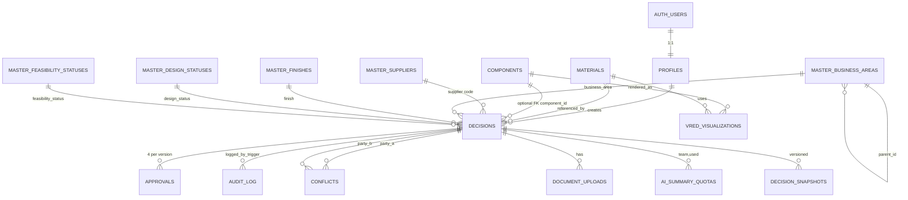

---

# 16. API Endpoints

## Supabase (auto-generated REST via PostgREST) - reached by the frontend

| Method | Endpoint | Purpose | Input | Output | Auth |
|---|---|---|---|---|---|
| GET | `/rest/v1/decisions?...` | list decisions | filters as query params | JSON array | JWT |
| POST | `/rest/v1/decisions` | create | JSON body | inserted row | JWT (design only) |
| PATCH | `/rest/v1/decisions?id=eq.<id>` | update fields / status | JSON body | updated row | JWT (column-guard) |
| GET | `/rest/v1/approvals?decision_id=eq.<id>` | list approvals | – | array | JWT |
| POST | `/rest/v1/approvals` | approve/reject | body | row | JWT (own team only) |
| GET | `/rest/v1/audit_log?...` | audit view | – | array | JWT (select only) |
| WS | `/realtime/v1/websocket` | live updates | channel subscribe | change events | JWT |
| POST | `/auth/v1/token` | login | email/password | session | – |
| POST | `/auth/v1/signup` | signup | email/password/metadata | user | – |

## FastAPI AI service

| Method | Endpoint | Purpose | Input schema | Output schema |
|---|---|---|---|---|
| GET | `/health` | liveness | – | `{status: "ok"}` |
| POST | `/readiness` | score a decision against RC-1..RC-6 | `ReadinessRequest` | `ReadinessResponse` (per-criterion + aggregate) |
| POST | `/conflicts` | detect conflicts in a business area | `ConflictRequest` | `ConflictResponse` |
| POST | `/summarise` | one-line rationale per row (Meldeliste) | `SummaryRequest` | `SummaryResponse` |
| POST | `/my-summary` | per-user performance markdown | `MySummaryRequest` | `MySummaryResponse` |
| POST | `/report-summary` | markdown briefing for any report payload | `ReportSummaryRequest` | `ReportSummaryResponse` |
| POST | `/priority-briefing` | decision briefing OR programme audit narrative (dual-mode via `context`) | `PriorityBriefingRequest` | `PriorityBriefingResponse` |
| POST | `/chat` | multi-turn conversational assistant | `ChatRequest` | `ChatResponse` |

## Deno Edge Functions

| Endpoint | Trigger | Purpose |
|---|---|---|
| `/functions/v1/on-decision-submitted` | pg_net on status→submitted | scoring pipeline |
| `/functions/v1/detect-conflicts` | pg_cron every 30 min | conflicts pipeline |
| `/functions/v1/dima-lookup` | frontend | material properties by code |
| `/functions/v1/vred-preview` | frontend | render URL by material code |

---

# 17. Authentication & Authorization

## Sequence

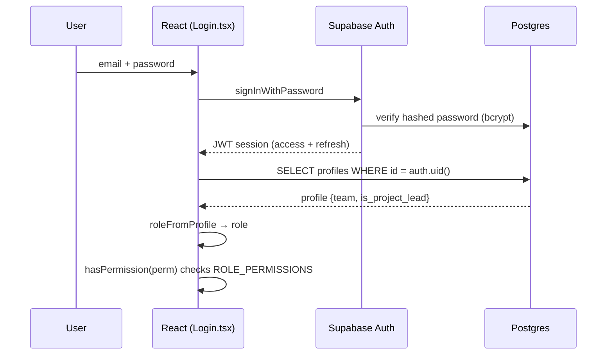

## Signup
- `signUp` sends `full_name`, `team`, `is_project_lead` in `options.data`.
- Postgres trigger `on_auth_user_created` (migration 0006) creates the matching `profiles` row automatically.

## Passwords
- Handled entirely by Supabase Auth (Gotrue). No custom hashing in this code.

## Tokens
- JWT stored in `localStorage` (Supabase default `persistSession: true`). Auto-refreshed.

## Authorization layers
1. **Frontend** - `useAuth().hasPermission()` hides UI (`ROLE_PERMISSIONS` in `utils/permissions.ts`).
2. **RLS** - Postgres cannot see rows/perform writes you shouldn't. Uses `current_team()` helper.
3. **Column-guard trigger** - even a legitimate write can be rejected per-column.
4. **AI-write gate** - anything with `auth.uid() is null` (service-role) bypasses guards; anyone else touching AI cols is rejected.
5. **Project Lead override** - `is_project_lead()` = true → `v_is_lead` bypasses column rules, still audit-logged.

## Dev-bypass
`AuthContext.devBypassLogin()` mints a mock session (`access_token: "mock-token"`)
---

# 18. Error Handling

- **Validation** - Pydantic on the AI service; TypeScript + inline React validation on the frontend.
- **Postgres errors** - surfaced through `@supabase/supabase-js`'s `{ data, error }` pattern. Frontend usually shows the message.
- **RLS/guard denials** - return HTTP 401/403; code `42501` in the message text.
- **LLM failures** - `readiness_service` catches `TimeoutError | ValidationError | JSONDecodeError | ValueError | KeyError | Exception` and falls back to a deterministic sentence with the `ai_fallback` flag.
- **AI service unavailable** - Edge Function writes `ai_rating: yellow`, `ai_unavailable` flag.
- **Realtime disconnects** - the channel just reconnects; page state stays consistent because reload always re-fetches from the DB.

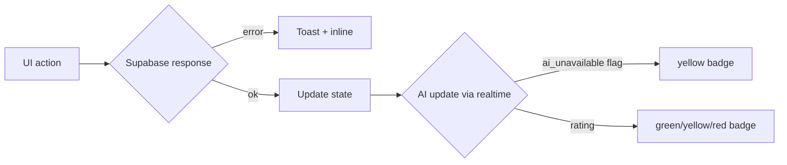

---

# 19. Configuration

## Frontend `.env.local`
```
VITE_SUPABASE_URL=<REDACTED>
VITE_SUPABASE_ANON_KEY=<REDACTED>
VITE_AI_SERVICE_URL=http://localhost:8000
```

## AI service `.env`
```
LLM_PROVIDER=mock | openai | anthropic | groq
OPENAI_API_KEY=<REDACTED>
OPENAI_MODEL=gpt-4o-mini
ANTHROPIC_API_KEY=<REDACTED>
ANTHROPIC_MODEL=claude-3-5-sonnet
```

## Edge Functions (Deno env)
```
SUPABASE_URL=<REDACTED>
SUPABASE_SERVICE_ROLE_KEY=<REDACTED>
AI_SERVICE_URL=http://host.docker.internal:8000
```

## Postgres runtime GUCs
```
app.supabase_functions_url = http://kong:8000/functions/v1
app.service_role_key       = <REDACTED>
```

---

# 20. Application Startup

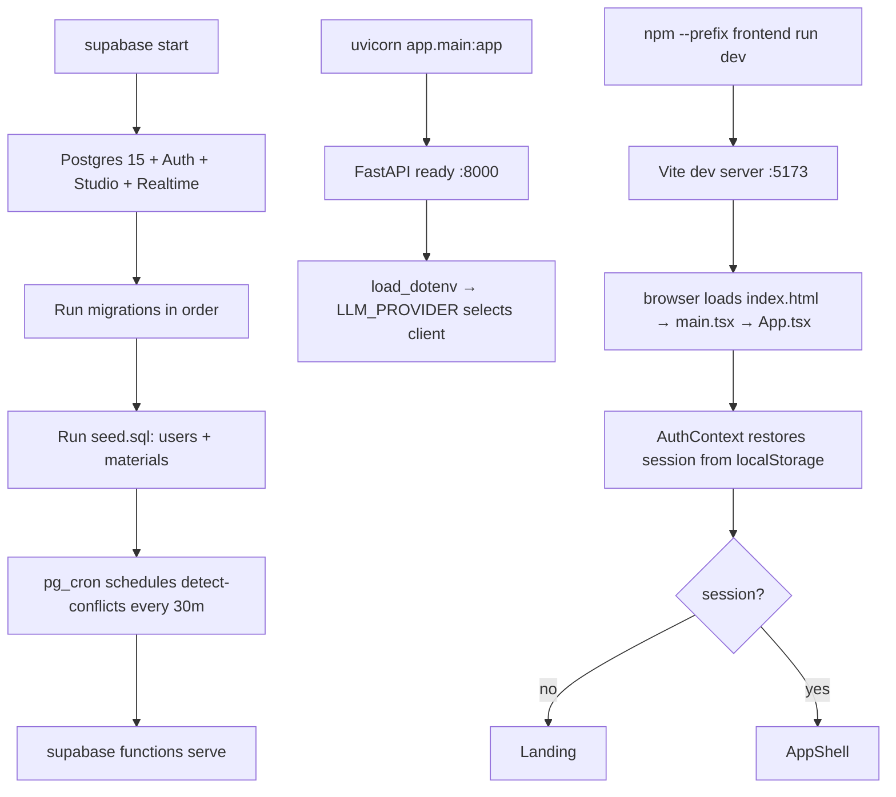

**Entry points**
- Frontend: [frontend/src/main.tsx](frontend/src/main.tsx) → `App.tsx`.
- AI service: `uvicorn app.main:app` (see [ai-service/README.md](ai-service/README.md)).
- DB: `supabase start` → migrations → seed.

---

# 21. Major Features

1. **One-record collaborative editing** across 4 teams with per-column ownership.
2. **AI Readiness scoring** - 6 deterministic criteria (RC-1..RC-6) each rated green/yellow/red + aggregate, plus LLM narrator.
3. **Per-criterion RC matrix** on Dashboard - heatmap of `rc1_lifecycle`..`rc6_conflict` × decisions.
4. **Approval workflow with cascade rejection** (Design → Engineering → Procurement → Quality) with PPAP implicit-approval on re-submit.
5. **Automatic AI auto-reject** on red - `_ai_auto_reject.sql` moves red-rated submissions straight to `rejected` and cascades approvals.
6. **Conflict detection** (RC-6) - pg_cron every 30 min + on submit; types: colour, material, finish, lifecycle, visual-mismatch (VRED).
7. **Real-time UI** through Supabase Realtime channels (`decisions-live`, `approvals-live`, `conflicts-live`, `audit_log-live`).
8. **Audit trail** on every mutation (SECURITY DEFINER trigger) + `is_admin_override` flag for lead overrides.
9. **Model-year segregation** - RC-6 only compares decisions with matching `model_year`, avoiding false conflicts across configurations.
10. **Reports** - Meldeliste (xlsx), Colour-Mix-Chart (pdf), AI Readiness, Supply Chain, Compliance Audit. All reports (except Compliance) have an on-demand `/report-summary` LLM overlay.
11. **AI touch-points from the UI** - floating **Chat Assistant** (`/chat`), **My Summary** modal (`/my-summary`), **Priority Briefing** (per decision) and **Programme Briefing** (portfolio audit narrative) - both hit `/priority-briefing` with different `context`.
12. **Deterministic audit engine** - `frontend/src/lib/auditSignals.ts` computes blocked, bottleneck, stale-approval, RBAC-violation and audit-gap findings without any LLM call and feeds them as *evidence context* to the LLM narrator.
13. **AI Decision Intel & Reference modals** - `AiDecisionIntelModal`, `RCReferenceModal`, `WorkflowGuideModal`, `AiGuideModal` for onboarding and demoing how AI engages.
14. **AI Quota system** - client-side (`aiQuota.ts`, 2/day, 4/day for admin) + server-side (`ai_summary_quotas` table + `increment_ai_quota` RPC, hard cap 2 views per team per decision).
15. **RBAC** - 12 role variants (`{team}_editor|approver|viewer` × 4 teams + `project_admin`) × 20+ permissions. Managed via `Rbac.tsx` (Role Definitions / Permission Matrix / Team Members / Invitations tabs).
16. **Master data admin** - components, materials, suppliers, hierarchical business areas, VRED renders, design/feasibility statuses, UV/Chemical requirements, technical constraints.
17. **Versioning + snapshots** - `decisions.version` bumps on data change; older approvals become stale; `decision_snapshots` freezes the row.
18. **Takeover** - `_takeover.sql` allows a peer editor or lead to claim / release a decision's `<team>_owner_id`.
19. **Project-Lead override** - `override_decision_field(...)` RPC; every override is audited with `is_admin_override=true` and full transparency across teams.
20. **Global search (Cmd+K)** via `SearchPalette.tsx`.
21. **Document uploads** - Design reference files stored via `document_uploads` (`_document_uploads.sql`).

---

# 22. Feature-by-Feature Flows

### 22.1 Create decision (Design)

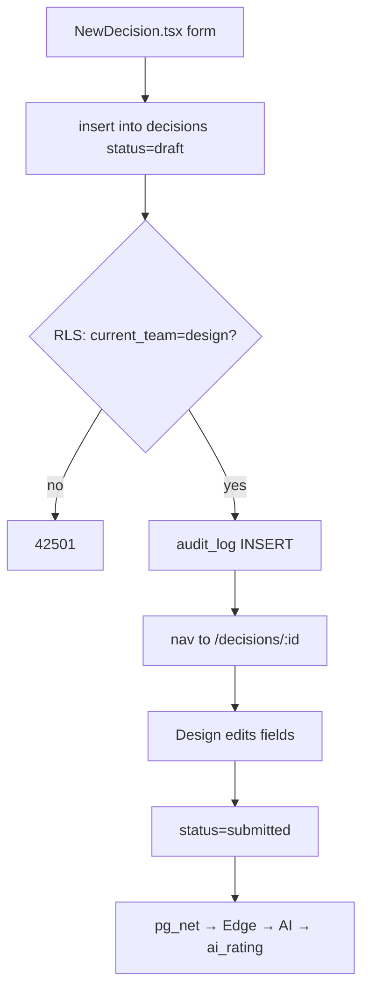

### 22.2 Approve/Reject

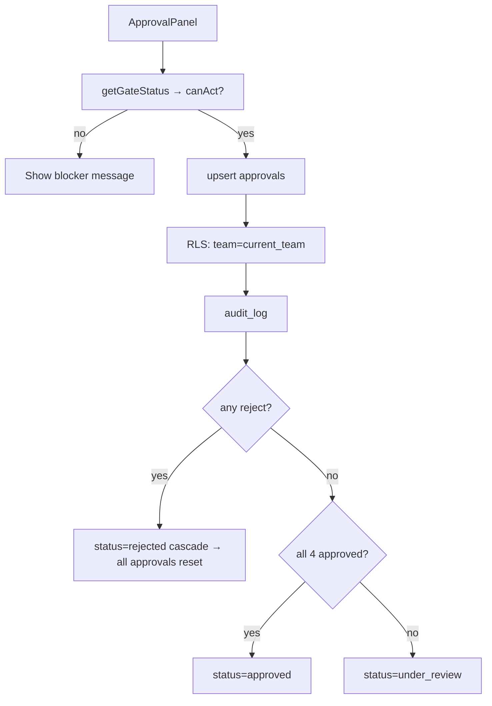

### 22.3 Conflict detection

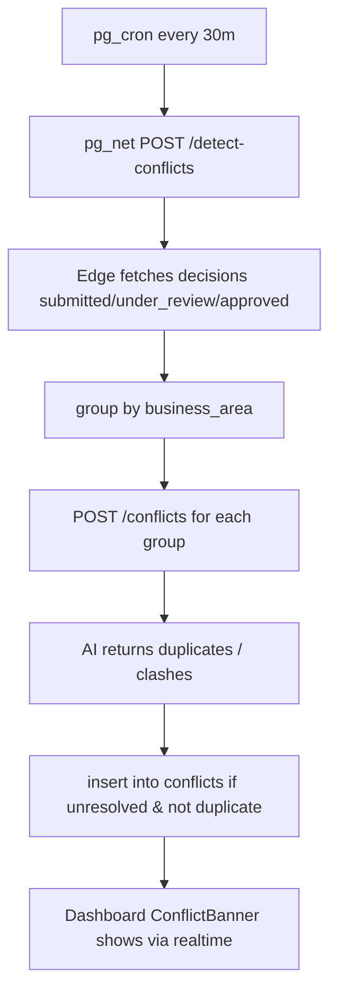

### 22.4 Meldeliste export

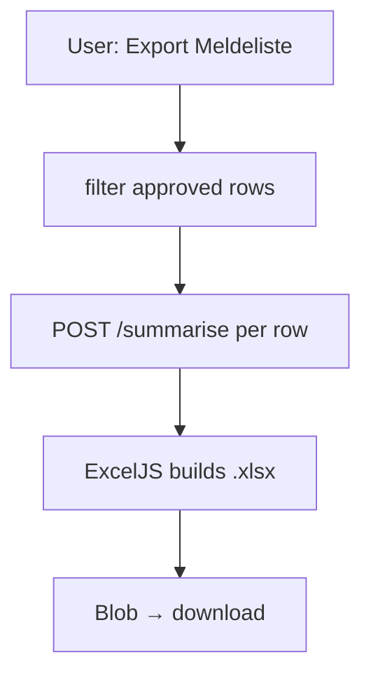

### 22.5 AI Auto-Reject on Red (post-submit)

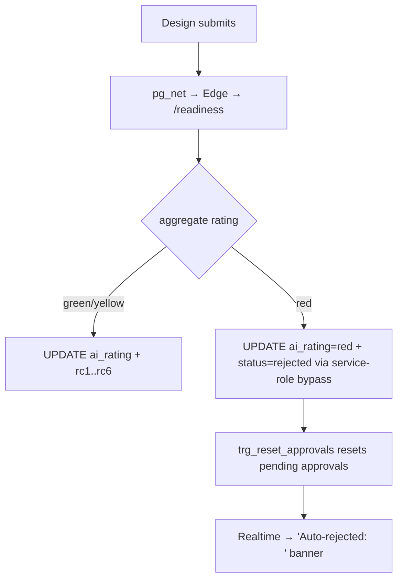

### 22.6 Priority Briefing (per decision, quota-gated)

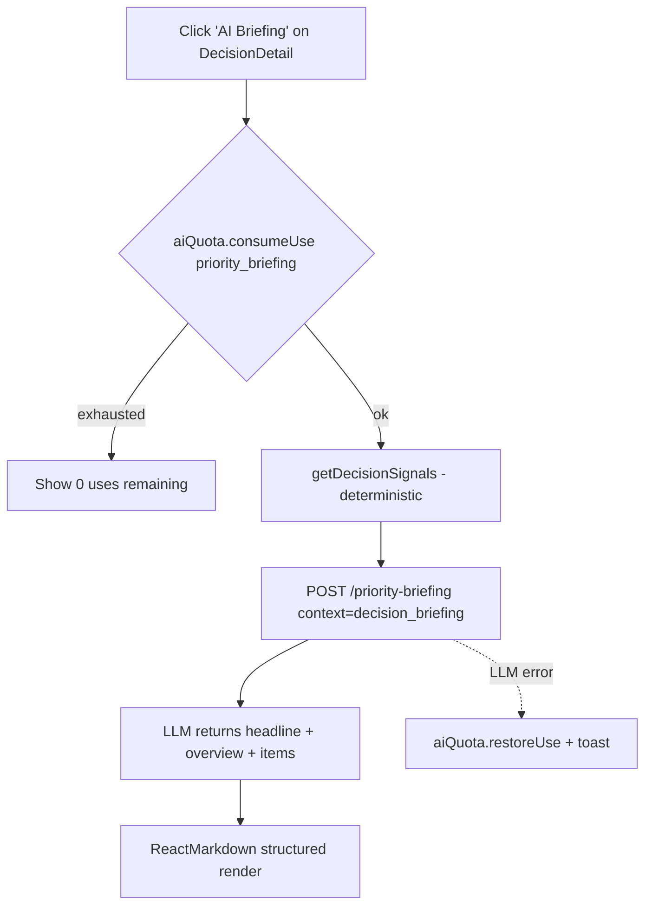

### 22.7 Programme Briefing (portfolio audit narrative)

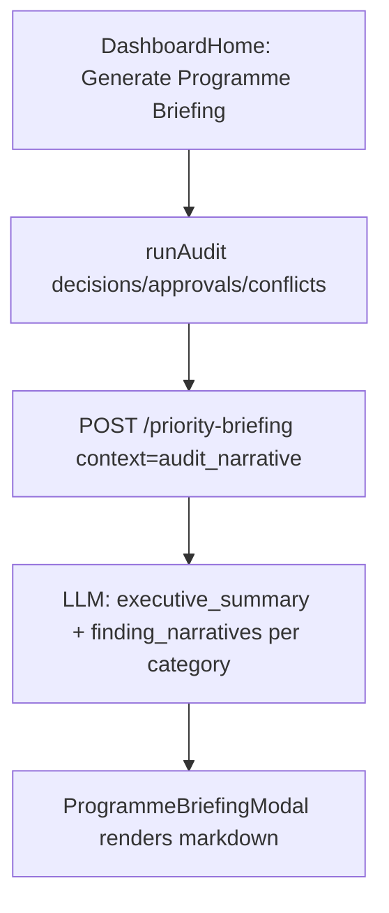

### 22.8 Chat Assistant (Cmd-K-style guidance)

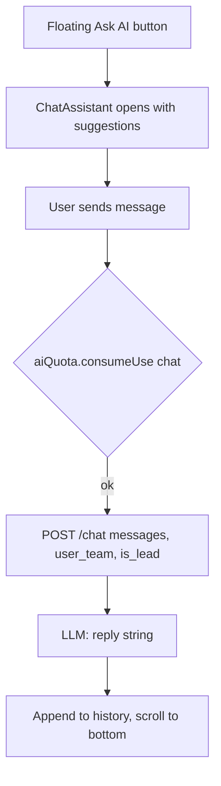

### 22.9 Takeover / Claim

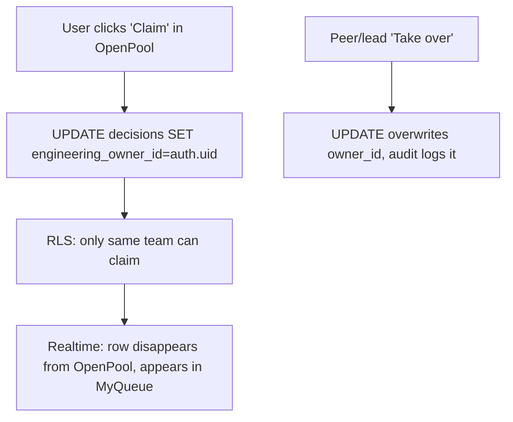

---

# 23. Design Patterns

| Pattern | Where | Why |
|---|---|---|
| **Layered architecture** | Frontend → Supabase → Edge → AI | Separates presentation, data/security, intelligence |
| **Repository-lite** via PostgREST | `supabase.from('table')` calls | Uniform CRUD without hand-writing endpoints |
| **Provider (Context)** | `AuthContext`, `FilterContext` | Share session/permissions/filters app-wide |
| **Strategy** | `llm.py` `LlmClient` protocol with Mock/OpenAI/Anthropic | Swap LLM provider by env |
| **Deterministic core + LLM narrator** | `readiness_service`, `auditSignals.ts` fed into `/priority-briefing` | LLM cannot change the rating, only phrase it |
| **State machine** | column-guard status transitions | Enforces `draft→submitted→under_review→approved/rejected` |
| **Trigger-based observer** | `pg_net` on status change | Decouples DB from AI service |
| **Fire-and-forget** | Edge Function does not block the DB update | Keeps writes fast |
| **Optimistic UI** | ApprovalPanel `onOptimisticUpdate` | Snappy feel while realtime catches up |
| **Fallback** | AI service unavailable → yellow + flag | Never blocks the human workflow |
| **Contract-first** | Pydantic schemas at every LLM boundary | Rejects hallucinated JSON |
| **Token-bucket-style quota** | `aiQuota.ts` per-day + `ai_summary_quotas` per-decision | Cost + abuse control |
| **CQRS-lite** | Reports read entirely from Postgres; writes only via constrained RPCs (`set_ai_readiness`, `override_decision_field`, `increment_ai_quota`) | Reads unrestricted, writes narrow |

---

# 24. Code Execution Map - "Submit for review"

```text
DecisionDetail.tsx  (button click)
   └── supabase.from('decisions').update({status:'submitted'}).eq('id',id)
Postgres
   ├── decisions_column_guard (BEFORE)
   ├── row update
   ├── audit_row_change (AFTER)
   └── notify_decision_submitted (AFTER of status)
       └── net.http_post → Edge Function
Edge Function on-decision-submitted/index.ts
   ├── serviceClient.from('decisions').select('*')
   ├── serviceClient.from('materials').select('*')
   ├── serviceClient.from('approvals').select('*')
   └── fetch(AI_URL+'/readiness', body)
FastAPI main.py → readiness_service.evaluate
   ├── scoring.score_all → score_rc1..rc6
   ├── scoring.worst_colour
   └── _deep_analysis → llm.complete_json → LLM
Back to Edge Function
   └── serviceClient.from('decisions').update({ai_rating, ai_reason, ai_flags, ai_last_checked_at})
Postgres Realtime → all subscribed frontends → RatingBadge re-renders.
```

---

# 25. "If I change this file, what breaks?"

| File | Blast radius |
|---|---|
| `migrations/…_schema.sql` | Everything. This is table shape. Never edit - add a new migration. |
| `migrations/…_column_guards.sql` | Wrong teams could edit each other's columns → data integrity gone. |
| `types/db.ts` | Compile-time only. Drift with DB is a runtime risk - hand-written = weak link. |
| `schemas.py` (AI) | LLM boundary contract. Change fields → Edge Function or frontend payload must change too. |
| `scoring.py` | Rating logic. Tests in `tests/test_endpoints.py` must pass. |
| `AuthContext.tsx` | Any page that reads session/role. |
| `supabase.ts` | Every page. Also breaks realtime. |
| `App.tsx` (routes) | Deep links; navigation. |
| `on-decision-submitted/index.ts` | AI never runs. Decisions stay unrated. |

---

# 26. Testing

- **Framework:** pytest ([ai-service/pytest.ini](ai-service/pytest.ini), [ai-service/tests/test_endpoints.py](ai-service/tests/test_endpoints.py)).
- **Strategy:** contract tests using `TestClient(app)` and `LLM_PROVIDER=mock`.
- **What's proven:**
  - `/health` returns `{"status":"ok"}`.
  - `/readiness` always returns a valid shape (`rating in {green,yellow,red}`, non-empty `reason`, list `flags`).
  - Fallback path is exercised (e.g., broken LLM client).
---

# 27. Deployment

**Confirmed from code:**
- Local Supabase via `supabase start` (Docker/Podman).
- Frontend built by `vite build` (`npm run build`).
- AI service run by `uvicorn app.main:app`.
- Ports: Supabase API 54321, Postgres 54322, Studio 54323, Vite 5173, FastAPI 8000.

**Not found in the provided codebase:**
- No Dockerfile for AI service or frontend.
- No `docker-compose.yml`.
- No CI/CD (`.github/workflows/`, `.gitlab-ci.yml`).
- No cloud IaC (Terraform, Bicep).
- Only a local dev proxy exists at [scripts/ipv4-proxy.cjs](scripts/ipv4-proxy.cjs).


---

# 28. Security

| Control | State |
|---|---|
| Authentication (email + password, JWT) | Implemented (Supabase Auth) |
| Authorization - RLS | Implemented ([migration 0002](supabase/migrations/20260902000002_rls.sql)) |
| Authorization - per-column | Implemented ([migration 0004](supabase/migrations/20260902000004_column_guards.sql)) |
| Audit log | Implemented ([migration 0003](supabase/migrations/20260902000003_audit_triggers.sql)) |
| AI write gate | Implemented (`v_ai_changed` check) |
| Password hashing | Implemented by Supabase Auth (not our code) |
| Input validation | Pydantic (AI service), TS types (frontend) |
| SQL injection | Not applicable - no hand-written SQL from the frontend; PostgREST + parameterised statements |
| CORS | **Wide open** on FastAPI (`allow_origins=["*"]`) - needs tightening |
| Rate limiting | **Not implemented** on FastAPI |
| CSRF | Bearer tokens in header - CSRF risk is low; no cookies-with-credentials pattern found |
| XSS | React auto-escapes; no `dangerouslySetInnerHTML` seen in files I inspected |
| Secrets management | `.env` files, service_role only inside DB / Edge Functions |
| HTTPS in production | Cannot confirm from the provided project |
| Prompt-injection resistance | Prompt says "Respond ONLY with JSON matching schema"; Pydantic validates - good, not perfect |
| Cost / abuse control | AI Quota - client-side (`aiQuota.ts`, 2/day, 4 for admin) + DB `ai_summary_quotas` (2 views/team/decision) via `increment_ai_quota` RPC. Frontend quota bypassable by wiping localStorage; DB quota is authoritative. |
| Admin override transparency | `override_decision_field(...)` RPC stamps `audit_log.is_admin_override = true`; visible to all users on Activity Log |
| PII in payloads | Decision payloads sent to LLM only contain component/material/business fields; user profile fields (name/email) are never sent to the LLM |

---

# 29. Performance

**What's fast:**
- Realtime updates instead of polling.
- Client-side reports (no server render cost).
- Indexes on `business_area`, `status`, `owner_team`, `material_reference`.

**Bottlenecks visible in code:**
- Meldeliste calls `/summarise` **per row** - N HTTP calls; slow for large batches.
- `runReadinessCheck` runs several sequential Supabase queries; some could be parallelised (some already are via `Promise.all`).
- No caching of AI responses; the same unchanged decision can be re-scored.
- LLM timeout is 20s - user-visible on the direct-call features (chat, briefing).
- `types/db.ts` is hand-written → future perf/correctness risk if fields drift.

**Not implemented:** Redis or in-memory caching, connection pooling config, pagination on the Dashboard (relies on filters only) as we had not enough time to do this.

---

# 30. Complete End-to-End Story

Imagine you are our cool jury, a designer at a VW-group brand. It's Monday morning.

1. Anna logs in at [Login.tsx](frontend/src/pages/Login.tsx). Supabase Auth returns a JWT; the app loads her profile and sees `team = 'design'`.
2. On the Dashboard, RLS lets her read every decision. Realtime hooks her up to `decisions-live`.
3. She clicks *New Decision*. Only Design can - enforced twice: UI hides the button for others, and RLS would reject the insert anyway.
4. In [NewDecision.tsx](frontend/src/pages/NewDecision.tsx) she picks a component, colour code `CS-114`, material `MAT-7892`, finish "Gloss 45", temperature range −20 → 80 °C, and clicks *Save*.
5. Row inserted in `decisions` with `status='draft'`. `audit_log` records the insert automatically.
6. Anna fills more details, then clicks *Submit for Review*. Postgres runs the column-guard (allows `draft→submitted` for Design), writes an audit row, then fires `pg_net` to the `on-decision-submitted` Edge Function.
7. The Edge Function loads context (decision + DiMa material + approvals) and POSTs `/readiness`.
8. FastAPI runs the six deterministic scorers - lifecycle, compliance, lead time, VRED visual, RBAC, cross-area conflict. Result: `yellow`.
9. The LLM narrator, given the deterministic evidence, writes: *"Material lifecycle and compliance are OK, but lead time of 24 weeks exceeds the 20-week threshold."*
10. Response comes back; the Edge Function uses service-role to write `ai_rating='yellow'`, `ai_reason=...`.
11. Realtime pushes the change to every open browser. Anna's Dashboard flips the yellow badge next to that row.
12. Ben in Engineering opens the decision. He fills in feasibility, part number, validates the temperature range. He approves. His column-owned fields are the only ones he can touch (guard trigger).
13. Cara in Procurement adds supplier and lead time. Suppose she enters 30 weeks - the next AI re-run raises to red.
14. Diana in Quality reviews. She sees the AI flag, sees Procurement approved anyway, and rejects. Cascade sets `status='rejected'`; Anna gets a new task and the version bumps on re-submit. Old approvals are stale.
15. Every action is in `audit_log`. Every 30 minutes `detect-conflicts` scans for duplicate colour codes in the same business area - if Anna's row and another designer's row clash, a banner appears on the Dashboard.

That's the whole app: **collect once, enforce at the database, decide with humans, advise with AI.**

---

# 31. Final Outcome

- **In:** four teams' edits, RBAC, DiMa lookups, VRED renders.
- **Internally:** RLS + column-guard + audit + AI hook + LLM narration + realtime broadcast.
- **Out:** one approved (or rejected) decision per component, with a green/yellow/red rating, a plain-English reason, an exportable Meldeliste, a Colour-Mix-Chart, and a full audit trail.
- **Value:** the OEM ships the right colour on the right material with the right supplier - with an auditable trail across four teams.

---


# 37. OVERALL HARDWORK

```text
PROJECT:            Chroma Sync
PURPOSE:            One record per component, 4 teams collaborate, AI advises, humans decide
USERS:              Design / Engineering / Procurement / Quality / Project Lead (VW-group multi-brand)
FRONTEND:           React 18 + Vite + TS 5.6 + React Router 6 (+ framer-motion, recharts, mermaid, zod)
BACKEND:            Supabase (Postgres 15 + Auth + Realtime + Storage), Deno Edge Functions
AI:                 FastAPI 0.115 + Pydantic 2 + httpx, LLM = mock/OpenAI/Anthropic/Groq (env-swap)
DB:                 Postgres 15, tables: profiles, materials, decisions, approvals, audit_log, conflicts (+later master data)
AUTH:               Supabase Auth (email/pw, JWT localStorage) + profiles row + RLS + column guard + audit + AI-write gate
MAIN API:           /readiness /conflicts /summarise /my-summary /priority-briefing
ARCHITECTURE:       React → Supabase (RLS + triggers) → pg_net → Deno Edge → FastAPI (deterministic + LLM)
ENTRY POINT:        main.tsx → App.tsx  |  uvicorn app.main:app  |  supabase start
IMPORTANT FOLDERS:  supabase/migrations, supabase/functions, ai-service/app/services, frontend/src/pages, frontend/src/components
IMPORTANT FILES:    schema/rls/column-guard/audit/ai_hooks migrations · readiness_service.py · scoring.py · on-decision-submitted/index.ts · ApprovalPanel.tsx · AuthContext.tsx
MAIN USER FLOW:     Design creates → submits → AI scores → 4 approvals → Quality signs off → reports
DB FLOW:            insert/update decisions → guard/audit/notify triggers → Edge → AI → service-role update → realtime
DEPLOYMENT:         Local only (supabase start + uvicorn + vite). No CI/CD/Docker/prod IaC found.
BIGGEST STRENGTH:   Security in the DB, deterministic AI ratings, real-time UI, full audit trail
BIGGEST WEAKNESS:   CORS *, no rate limit, hand-written db.ts, dev-bypass login, no E2E tests, no deployment automation
IMPROVEMENTS:       Generate db.ts from schema · Dockerise AI · GitHub Actions CI · CORS allowlist + rate limit · E2E Playwright tests · Redis cache for AI results
```

---

# 39. One-Page Mental Model

```text
                        USER (React SPA)
                             │
                    JWT + PostgREST/Realtime
                             │
                     ┌───────▼────────┐
                     │  SUPABASE      │
                     │  Postgres 15   │
                     │  Auth · RLS    │
                     │  Realtime · pg_net · pg_cron │
                     │  audit_log    │
                     └───────┬────────┘
              status=submitted│                          ▲
                    (pg_net)  │                          │ service_role UPDATE
                     ┌────────▼─────────┐                │
                     │ DENO EDGE FUNCS  │                │
                     │ on-decision-submitted             │
                     │ detect-conflicts │────┐           │
                     └────────┬─────────┘    │           │
                              │              │           │
                              ▼              ▼           │
                     ┌────────────────────────────────┐  │
                     │  FASTAPI /readiness /conflicts │──┘
                     │  scoring.py (RC-1..RC-6)       │
                     │  llm.py (mock / openai / anthropic)
                     └────────────────────────────────┘
```

---

# 40. Final Master Mermaid Diagram

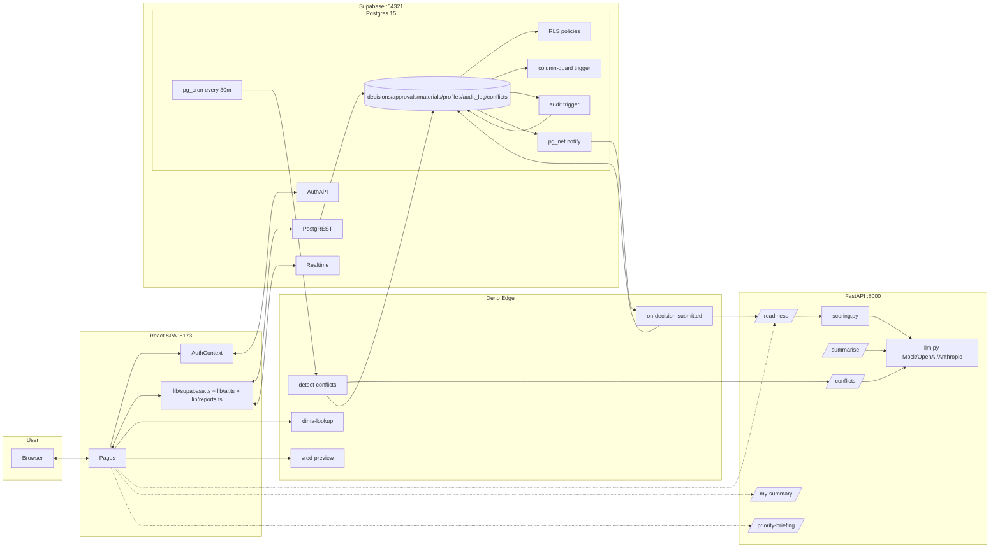

---


# 41. Final AI Architecture & Placement Map

The AI integration in Chroma Sync operates on three tiers (Global, Programme, Decision) and handles deterministic scoring vs. narrative intelligence distinctly.

### The 3-Tier AI Placement Map (our bone)

| Feature | Level | AI Used? | Deterministic Rule Engine? | Purpose |
|---|---|---|---|---|
| **AI Chat** | Global (floating button) | ✅ Full LLM (`/chat`) | ❌ None | Conversational workflow guide. Quota-gated. |
| **My Summary** | Per user | ✅ LLM markdown (`/my-summary`) | ✅ Aggregation counts (approval rate, AI health) | Personal performance snapshot. Quota-gated. |
| **Priority Briefing** | Per decision | ✅ Structured LLM (`/priority-briefing`, `context=decision_briefing`) | ✅ `getDecisionSignals()` frontend | "What's wrong with THIS decision and what to do next?" |
| **Programme Briefing** | Portfolio / All Decisions | ✅ Executive LLM narrative (`/priority-briefing`, `context=audit_narrative`) | ✅ Frontend `auditSignals.ts` `runAudit()` | "Across ALL decisions, what are the top risks?" |
| **AI Readiness Scoring** | Per decision (on submit) | ✅ LLM narrator (`/readiness`) | ✅ 6-criterion scorer + `worst_colour` | Rate decision health and escalate issues. |
| **Conflict Detection** | Per business area (submit + 30-min cron) | ✅ Pattern matching + narration (`/conflicts`) | ✅ `integrity_service.py` deterministic detectors | Find cross-decision conflicts (RC-6). |
| **Meldeliste Rationale** | Per approved row | ✅ Short LLM sentence (`/summarise`) | ✅ Row-level rules | One-line "why this passed" for Excel export. |
| **Report AI Insights** | Per report page | ✅ LLM markdown (`/report-summary`) | ❌ Payload passed straight to LLM | Human-readable narrative on top of any report's JSON. Quota-gated. |
| **AI Decision Intel Modal** | Static | ❌ None | ❌ None | Educational explainer of when/how AI engages. |

### Reports Layer (AI Insights Overlay)
Reports themselves (Meldeliste, Colour-Mix-Chart, Supply Chain, AI Readiness Scorecard) are deterministic data displays. They do **not** use AI to aggregate the tables. However, each report features an **AI Insights Overlay** (`ReportAISummary.tsx`) that reads the report's current payload and calls `/report-summary` to generate an intelligent markdown briefing of the data on demand (consuming daily quota).

**Compliance Audit is intentionally AI-free** - it is a regulatory export, so hallucination risk is unacceptable. It relies purely on `auditSignals.ts` + `audit_log` diffs.

### Deterministic → Narrative Handoff Rule

Every LLM call in Chroma Sync follows the same pattern:

1. Compute the *facts* deterministically (in Postgres, in `scoring.py`, or in `auditSignals.ts`).
2. Pass those facts to the LLM as *evidence context* in the payload.
3. The system prompt tells the LLM: *"Narrate the provided evidence. Do not invent findings. Do not change ratings."*
4. Pydantic validates the response; on invalid JSON or timeout, fall back to a deterministic sentence built from the facts and flag it `ai_fallback`.

This is why the app is safe to demo without an LLM key - with `LLM_PROVIDER=mock`, every feature returns coherent deterministic output.

---

# 42. Some more features which we wanted to share

This section documents functionality added on top of the core build described above.

## 42.1 PKI Card Login (Demo IdP)

- **Where:** [frontend/src/pages/Login.tsx](frontend/src/pages/Login.tsx), `signInWithPKI` in [frontend/src/auth/AuthContext.tsx](frontend/src/auth/AuthContext.tsx).
- **What:** A "Sign in with PKI card (IdP)" button opens a **full-window modal** prompting for a card PIN. Entering a valid PIN authenticates the user.
- **How (demo):** `signInWithPKI(pin)` maps a card PIN to a seeded account and performs a **real Supabase password sign-in** (all demo users share the password `chroma-demo`), so it yields a genuine session rather than a mock. PIN map: `1001`–`1012` for the four teams × three roles, `9999` admin, `0000` viewer. PINs are also stored per-profile in `profiles.pki_pin` (see [supabase/seed.sql](supabase/seed.sql)).
- **Auto-prompt:** If the email/password fields are left empty for **5 seconds**, the PKI modal opens automatically (simulating card-first login).
- **Honest tradeoff:** The PIN→email map lives client-side for the demo. A production build would validate the PIN against a real IdP/edge function and never embed credentials in the bundle.

## 42.2 Forgot / Reset Password

- **Where:** `resetPassword` in [frontend/src/auth/AuthContext.tsx](frontend/src/auth/AuthContext.tsx), modal in [frontend/src/pages/Login.tsx](frontend/src/pages/Login.tsx), new page [frontend/src/pages/ResetPassword.tsx](frontend/src/pages/ResetPassword.tsx).
- **What:** "Forgot password?" opens a modal that sends a secure reset link via `supabase.auth.resetPasswordForEmail(email)`. The link redirects to `/reset-password`, where the user sets a new password via `supabase.auth.updateUser({ password })`.
- **Security note:** The flow never lets the browser change an arbitrary account's password directly (that would let anyone reset anyone's password). Supabase only emails the link if the account exists, and the message shown is deliberately neutral so account existence is not leaked. Requires SMTP configured in the Supabase project to deliver mail.
- **Routing:** `/reset-password` is registered in both the authenticated (recovery-session) and unauthenticated route blocks in [frontend/src/App.tsx](frontend/src/App.tsx).

## 42.3 Notifications Overhaul

- **Where:** [frontend/src/components/layout/Header.tsx](frontend/src/components/layout/Header.tsx).
- **Source:** Notifications are derived from the `audit_log` table (all authenticated roles can read it via RLS `using (true)`), so every role is notified on any audited change.
- **Live delivery:** A Supabase Realtime channel on `audit_log` reloads the list on every insert/update. Migration [supabase/migrations/20260917000002_audit_log_realtime.sql](supabase/migrations/20260917000002_audit_log_realtime.sql) ensures `audit_log` is in the `supabase_realtime` publication so decision create/update events reach all roles.
- **Show all:** The list now loads up to 100 recent entries (was 5).
- **Delete / clear:** Each item has a delete (X) button, plus a "Clear all" action. Because `audit_log` is an immutable audit trail, dismissals are **persisted in `localStorage`** (`chroma-notif-dismissed`) rather than deleting DB rows. Read state is likewise persisted (`chroma-notif-read`).

## 42.4 Direct PDF Export of Report Cards

- **Where:** helper [frontend/src/lib/pdfExport.ts](frontend/src/lib/pdfExport.ts); wired into [frontend/src/components/EnterpriseReportView.tsx](frontend/src/components/EnterpriseReportView.tsx), [frontend/src/pages/ComprehensiveAudit.tsx](frontend/src/pages/ComprehensiveAudit.tsx), [frontend/src/pages/DecisionDeepAnalysis.tsx](frontend/src/pages/DecisionDeepAnalysis.tsx), [frontend/src/pages/RiskAssessment.tsx](frontend/src/pages/RiskAssessment.tsx).
- **What:** "Download PDF" buttons now capture the specific report card (`.assessment-document`, referenced via `useRef`) and save it directly as a multi-page A4 PDF — replacing the previous `window.print()` behaviour.
- **How:** `downloadElementAsPdf(element, fileName)` renders the DOM node with **html2canvas** (`scale: 2`) and paginates the image across A4 pages with **jsPDF**. New dependency: `html2canvas`.

## 42.5 UI Theme & Dashboard Enhancements

- **Teal palette retheme:** App-wide colour system moved to `#002733` (deep) / `#00EFD4` (accent) across [frontend/src/index.css](frontend/src/index.css), [frontend/src/styles.css](frontend/src/styles.css), [frontend/src/landing.css](frontend/src/landing.css), and the layout shell. Semantic green/amber/red are intentionally preserved for status clarity.
- **Dashboard charts:** [frontend/src/pages/DashboardHome.tsx](frontend/src/pages/DashboardHome.tsx) gained a full-circle percentage **Pipeline Health radial** (fixed 0–100 scale via `PolarAngleAxis`), a **Decision Status donut**, and a **Decisions by Business Area** bar chart, with aligned chart titles.
- **Icon fixes:** The topbar notification bell (🔔) and sidebar pin (📌/📍) use emoji glyphs for reliable visibility; modal close buttons use a `✕` glyph after the lucide `X` failed to render in some modals. The sidebar pin remains hidden until sidebar hover.


 # Made by Aditya & Venky (Team Maximus AI)

 We built **Chroma Sync** for the **2026 Hackathon**.

 Thanks for checking out our project!

 **Aditya & Venky**

